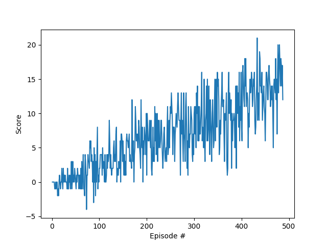
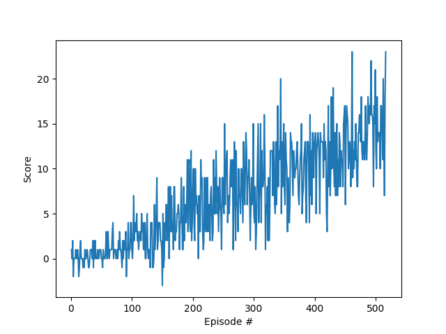
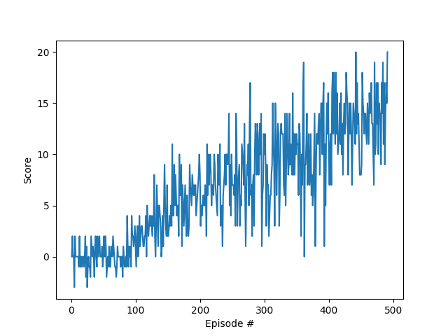
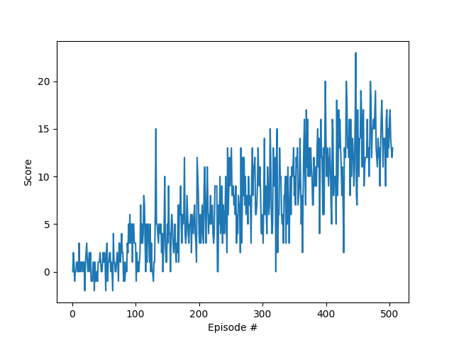
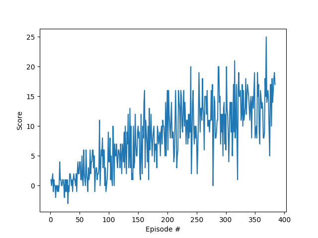

# Learning Algorithm Used
I used Udacity's DQN solution of LunarLander-v2
from the official Github repository
https://github.com/udacity/deep-reinforcement-learning 
as starting point. This project was more of 'get your feet wet with Unity ML' than 'find the best possible algorithm', 
so even solving the environment with the vanilla DQN solution was a great learning experience for me. 

The baseline architecture and hyperparameters are 

- 2 layer network for function approximation to q-function
- number of nodes in hidden layers: [64, 64]
- ReLU activation function
- replay buffer_size = 10000
- batch size = 64 
- discount factor = 0.99            
- soft update tau = 0.001  
- learning rate = 5e-4    
- epsilon start = 1
- epsilon end = 0.01
- epsilon decay = 0.995

##### Result
As you see here, the performance of the baseline is pretty
solid already: 

It solved the banana environment after 487 episodes. 

# Hyperparameter Tuning
Since RL in itself is rather expensive to compute, hyperparameter tuning with a grid search, as is
often done for supervised learning, will not be done here. I have only played with a very small 
number of parameters: network size, discount rate and epsilon decay rate.

## Changing the Network Size

### 2nd Experiment - Larger Network
To figure out whether the performance can be improved
by increasing the capacity of our function 
approximator, I doubled the number of nodes in the first
layer, i.e., 
number of nodes in hidden layers: [64, 64] -> [128, 64]

##### Result
We see that an increase did not help too much:

The environment was solved after 512 episodes, which is slightly worse (if we do not include the 
randomness of RL in our analysis!).

### 3rd Experiment - Smaller Network
So, it did not help to increase the capacity. Let's see if it helps to decrease the capacity:
number of nodes in hidden layers: [64, 64] -> [32, 16]

##### Result

The environment was solved after 491 episodes, which is slightly worse (agin, if we do not take into 
 account the randomness of RL).
 
### 4th Experiment - Higher Discount Rate
gamma: 0.99 -> 0.999

##### Result

The environment was solved after 505 episodes.

### 5th Experiment - Higher Epsilon Decay Rate
eps_decay: 0.995 -> 0.999

##### Result
The result here was a bit of a surprise to me. The previous experiments did not do much in 
 terms of performance. Adjusting the exploration decay rate has a quite big impact, however:
 after 800 episodes, the agent still had an average reward score of only
6.3. Since  was clear that this does not help the agent, I tried the opposite direction 
 in the last experiment: Decreasing the exploration rate decay.

### 6th Experiment - Smaller Epsilon Decay Rate
eps_decay: 0.995 -> 0.990

##### Result

This is the best result so far. The agent needed only 384 episodes, which is far better than the 
other experiments so far.

 
### Conclusion
While I did not do much hyperparameter tuning, varying the size of the network did not have an 
overly large effect of the result. Increasing the discount rate had no significant effect either. 
The only hyperparameter that produced a large effect was the eps discount factor. 
Exploration really seems to be a quite sensitive knob in DRL experiments!

### Ideas for Future Work
Since this was the first project, the set of possible improvements is huge: first of all, there
is more hyperparameter tuning of course. But as I've mentioned before, hyperparameter tuning is 
expensive in RL. Secondly, there 
are the various improvements to DQN that have been proposed since DQN has become famous, as e.g.
Double DQN. Thirdly, one could try an algorithm from a different family altogether (policy gradient
 algorithms, 
actor critic algorithms). 

The performance we have achieved is quite good. Of course, it's always possible to perform more 
more hyperparameter tuning or to try out a different algorithm altogether. It's also possible 
to try something like epsilon-decay for the Ornstein-Uhlenbeck process to reduce the amount
of exploration done with time, but given that hyperparameter 
tuning is expensive and time-consuming and that this version and implementation of 
DDPG performed so well, I see no reason to tweak the 
current implementation too much.
